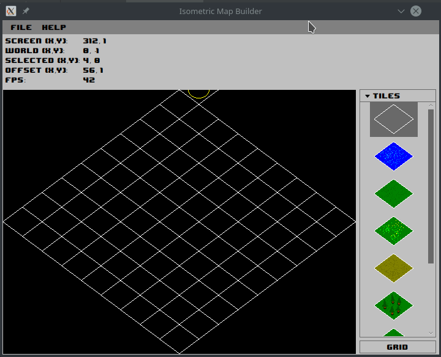
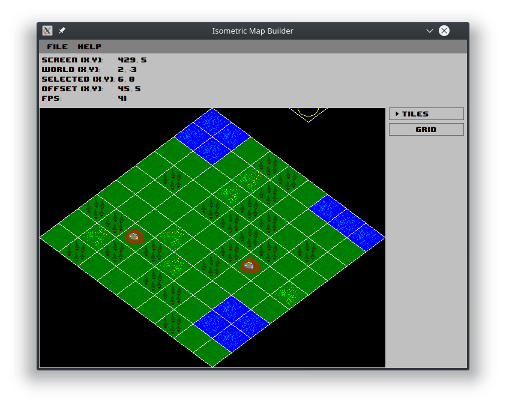

## Isometric Map Builder

#### Main Goal
Implement simple UI for constructing simple isometric
maps that involves math (screen space to map transformation and back)
with scripting engine that provides some functionality for configuration
preparation (scripts that allow configuring map builder with small effort)
without any external graphics libs/frameworks (opengl, d3dx, vulkan etc) 
using pure java approach (images, canvas etc)

#### Tasks
 - [x] Implement simple UI for map construction
 - [x] Implement 2D transformations (screen space to iso map and back)
 - [x] Implement simple persisting functionality
 - [x] Use scripting engine for config loading
 
 #### Screenshots
Implementation results:
 1. Isometric Map Builder

## Afterword
It's only a pet project for trying different ideas. I'm open
for any suggestions/improvements and it's also free to use.
Any credits to me will be enough :D
